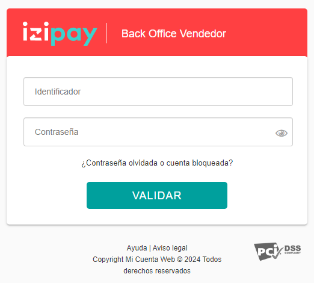
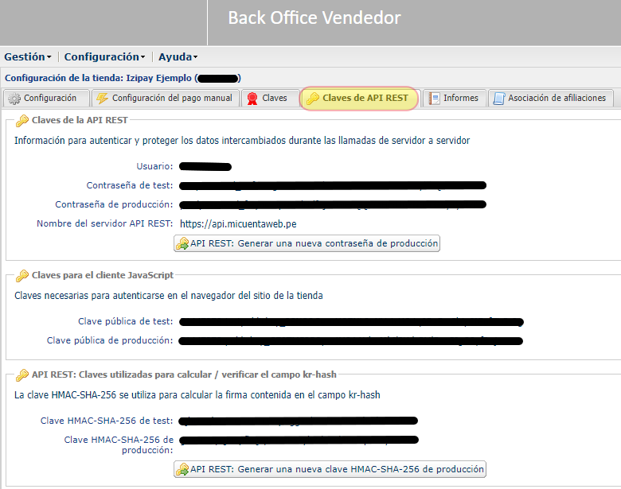

# OBTENER CREDENCIALES DE CONEXIÓN

Estos pasos son una guía de cómo obtener las credenciales que se requieren al momento de realizar la integración de la pasarela de pagos de Izipay con su página web.

## Requisitos Previos

* Tener una cuenta registrada dentro de Izipay `("izipay online")`, en caso de no contar con una cuenta, crear una nueva afiliación en el siguiente enlace: https://www.izipay.pe/izipay-online/

## 1. Ingresar al Back Office Vendedor

* Ingresar con la siguiente dirección web al Back Office Vendedor de Izipay: https://secure.micuentaweb.pe/vads-merchant/

* Acceder a la plataforma Back Office Vendedor con su identificador y contraseña que se envió a su correo después de afiliarse a Izipay.

     

* Código de seguridad: El código de seguridad es el número de DNI/RUC/CE con el cual se realizó la afiliación.

     

* Nueva contraseña: Ingresar una nueva contraseña según las indicaciones estipuladas, cabe resaltar que la contraseña se tiene que actualizar cada 90 días y nunca se pueden repetir.

     

## 2. Obtener claves de integración

* Acceder a la siguiente ruta, cuando se encuentre dentro del Back Office Vendedor: 'Configuración -> Tiendas -> Claves'

     

* Claves
Usadas para el formulario de pago en Redirección, Iframe y WebView(App)

   

* Claves de Api Rest
Usadas para el formulario Incrustado, Popin y SDK(App)

   
 